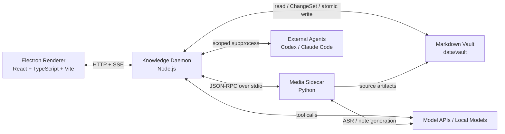

# vid2note 个人知识工作台目标设计规格

**日期**：2026-06-18

**作者**：用户与 Codex 共同设计

**状态**：目标设计已确认，待用户审阅书面规格
**性质**：目标架构规格，不是逐文件实施计划

---

## 1. 摘要

vid2note 将从“视频转 Markdown 笔记工具”升级为一个**本地优先、Obsidian 兼容、由 Agent 持续维护的个人知识工作台**。

产品不把每个视频仅保存为一篇孤立摘要。每当用户加入一个视频，系统会：

1. 保存不可原地改写的来源记录、字幕和来源身份；原视频是否长期保留由用户策略决定；
2. 生成带时间证据的高质量来源笔记；
3. 阅读现有 `index.md` 与相关 Wiki 页面；
4. 提出跨页面的结构化变更集；
5. 默认由用户审批后写入 Wiki；
6. 在问答时优先阅读 Wiki，必要时回查来源与时间码；
7. 用文字、截图或视频片段回答，并允许把新洞见再次写回 Wiki。

核心思想来自 Karpathy 的 LLM Wiki 方法论：**Raw sources 是事实源，Wiki 是持续编译的知识层，schema 是 Agent 的维护契约。**

产品的差异化不是“带聊天框的 Obsidian”，而是：

> 跨视频持续编译 Wiki，并让每条重要结论都能回到原视频证据。

---

## 2. 产品目标

### 2.1 北极星目标

首个可用版本必须证明：

> 加入第二个相关视频后，系统能够可靠增强已有 Wiki 页面，而不是只新增第二篇摘要。

### 2.2 目标用户

首要用户是需要长期消化视频内容的个人用户：

- 研究者与独立分析者；
- 课程、访谈、播客和长视频的重度学习者；
- 围绕一个主题持续积累资料的人；
- 希望保留原始证据，而不满足于聊天式摘要的人。

普通 Markdown 编辑不是主要竞争点。若用户只需要写笔记，Obsidian 已经足够。

### 2.3 核心价值

- **积累**：知识按概念和主题合并，不按视频堆积。
- **追溯**：重要主张绑定来源与时间区间。
- **可信**：Wiki 修改可预览、可审批、可回滚。
- **开放**：知识库是普通文件夹，不锁进专有数据库。
- **可协作**：内置 Agent 与外部 Codex、Claude Code 遵循同一套维护协议。
- **可迁移**：Vault 可直接由 Obsidian 打开，删除应用缓存不会丢失知识。

---

## 3. 非目标

首个版本明确不做：

- PDF、网页、电子书等多格式同时摄取；
- 向量数据库、Embedding RAG 或知识图谱数据库；
- 云同步、账号、多人实时协作；
- 多 Agent 自动分工；
- 复刻 Obsidian 的完整插件生态；
- 预先切分并保存全部视频片段；
- 同时支持十几种外部 Agent CLI；
- 让 Agent 绕过变更集直接修改正式 Wiki；
- 以更换技术栈本身作为产品成果。

架构可以为其他来源类型预留接口，但首版只把视频链路做深。

---

## 4. 已锁定的关键决策

| 维度 | 决策 |
|---|---|
| 首版核心 | 持续增长的 Wiki，而非聊天或工具集合 |
| 来源范围 | 只深做在线视频与本地视频 |
| 知识事实源 | 用户可见的 Markdown Vault |
| 数据库角色 | 任务、会话、缓存和可重建状态，不存 Wiki 正文 |
| 索引方法 | Karpathy Wiki：`index.md` 优先，不使用向量数据库 |
| 精确检索 | 文件名、双链、frontmatter 与普通文本扫描；不是独立知识层 |
| 默认写入权限 | 生成变更预览，用户批准后写入 |
| 高级自治 | 可切换自动写入可回滚、全自动但矛盾需确认 |
| Agent | 内置 Agent + 外部 CLI Adapter |
| 外部 Agent 首发 | Codex、Claude Code |
| Agent 参考 | 借鉴 Open Design 的 Runtime Registry 与事件归一化 |
| 桌面控制面 | Electron + React + TypeScript + Vite |
| 知识守护进程 | Node.js Knowledge Daemon |
| 媒体处理 | Python Media Sidecar，复用现有下载/FFmpeg/ASR/LLM 资产 |
| 主界面 | 工具轨 + Wiki 树 + 主阅读区 + Agent 面板 |
| 视觉方向 | 延续当前暖灰、细边框、紫色强调和克制桌面工具感 |
| Obsidian | Vault 可直接打开并允许用户手工编辑 |

---

## 5. 迁移前置条件

当前仓库仍在执行以下稳定性计划：

1. Phase 1：CI / 测试套件恢复；
2. Phase 2：前后端契约对齐；
3. Phase 3：产物下载与导出；
4. Phase 4：稳定性与错误处理。

本规格可以现在冻结，但逐文件实施计划必须等待迁移基线稳定。开始实施计划前必须满足：

- Phase 1–4 的目标提交均已落地；
- 工作树干净，或用户明确指定哪些未提交内容属于迁移基线；
- Python 测试、mypy、ruff 和前端构建重新验证；
- 修复或显式登记 `VID2NOTE_DATA_DIR` 没有贯穿数据库/产物/上传存储的问题；
- E2E 不再只验证“任务出现在 UI”，而是验证后台任务与产物确实成功；
- 当前分支已合并，或被明确指定为新架构的基线分支。

迁移不得以“新架构会替换旧代码”为理由跳过这些基线。旧流水线需要先成为可信的可迁移资产。

---

## 6. 目标系统架构

### 6.1 总体拓扑



Renderer 只连接 Knowledge Daemon。Renderer 不直接访问 Python，也不直接授权 Agent 修改正式 Vault。

### 6.2 Electron Shell

职责：

- 管理桌面窗口和原生菜单；
- 选择或创建 Vault 文件夹；
- 启动、监控和关闭 Knowledge Daemon；
- 向 Renderer 暴露最小化的 preload API；
- 使用系统 Keychain 保存密钥；
- 管理应用更新、单实例和崩溃恢复入口。

Electron Shell 不承载 Wiki、Agent 或媒体业务逻辑。

### 6.3 Renderer

技术栈：React、TypeScript、Vite、轻量状态管理、CodeMirror 6。

职责：

- Wiki 文件树、Markdown 阅读与编辑；
- Agent 会话与工具事件展示；
- ChangeSet Diff 审批；
- 视频、字幕、截图和片段播放；
- 任务状态、错误恢复和设置；
- 自治模式切换。

选择 React/TypeScript 的理由不是 Vue 不可用，而是：

- 本次主界面和数据模型本来就需要大幅重构；
- 与 Open Design 的 TypeScript Agent Runtime 更容易共享模型和测试思路；
- CodeMirror、Lexical 等富编辑/审阅生态更直接；
- Renderer、Daemon 与共享 contracts 可以端到端类型一致。

不采用 Next.js。Open Design 使用 Next.js 是为了 SSR、Vercel 和纯 Web 拓扑；本产品首要形态是本地桌面应用，Vite 更简单。

### 6.4 Knowledge Daemon

Knowledge Daemon 是产品控制面，负责：

- 唯一 data-root 与 Vault 路径解析；
- 文件树、Markdown 读取、双链与 `index.md`；
- Wiki Compiler 与 ChangeSet；
- Agent Runtime、CLI 检测和会话；
- Job 状态、SSE 事件与错误归一化；
- 媒体引用到 Python Job 的桥接；
- 安全路径解析、原子写入与版本快照；
- 可重建缓存和 SQLite 状态。

Knowledge Daemon 通过 loopback 随机端口提供本地 HTTP API。Renderer 从 preload 获取地址和短期会话令牌。所有流式任务使用 SSE；控制命令使用普通 HTTP。

### 6.5 Python Media Sidecar

Python Sidecar 只负责视频来源处理：

- 下载在线视频或接收本地视频；
- FFmpeg 音频提取、截图和片段生成；
- ASR 与时间轴标准化；
- 单来源结构化笔记生成；
- 思维导图等来源级衍生产物；
- 清理可再生中间文件。

它复用现有 `core/` 中成熟部分，但不再拥有 Wiki、Agent 会话或桌面配置。

Node 与 Python 使用 JSON-RPC 2.0 风格的 NDJSON stdio 协议：

- 每个请求有稳定 `request_id`；
- 进度通过 notification 推送；
- 支持取消、超时和进程重启；
- 二进制不经 stdio 传输，只返回共享 data-root 下的规范化文件引用；
- 消息 schema 在 TypeScript 和 Python 两侧均生成或验证。

不让 Python 再开放第二套面向 Renderer 的 HTTP API，避免双 API 真相源。

---

## 7. Vault 磁盘协议

### 7.1 默认目录

开发期默认 Vault 位于仓库根目录：

```text
data/vault/
```

正式桌面应用允许用户选择任意 Vault 文件夹。所有运行时组件必须从同一个已解析 data-root 派生路径，不允许各模块自行猜测相对目录。

### 7.2 目录结构

```text
data/vault/
├── AGENTS.md                         # Wiki schema 与 Agent 维护规则
├── index.md                          # 内容导航与一行摘要
├── log.md                            # 追加式操作日志
│
├── raw/                              # 追加式来源记录层
│   └── src_<date>_<hash>/
│       ├── source.yaml               # 来源身份、URL、哈希、标题、时长
│       ├── original.<ext>            # 原视频，受保留策略控制
│       ├── transcript.srt            # 原始标准字幕
│       └── transcript.md             # 带稳定时间锚点的逐字稿
│
├── sources/                          # 单一来源的结构化笔记
│   └── <source_id>--<slug>.md         # 稳定 id 防止同名覆盖
│
├── wiki/                             # 跨来源综合知识
│   ├── concepts/
│   ├── entities/
│   ├── topics/
│   └── comparisons/
│
├── assets/                           # Wiki 正式引用的持久附件
│
└── .vid2note/                        # 应用私有、可重建或可丢弃状态
    ├── state.sqlite3
    ├── cache/
    │   ├── clips/
    │   └── frames/
    └── changes/
        ├── pending/
        └── applied/
```

### 7.3 数据所有权

| 层 | 写入者 | 修改规则 |
|---|---|---|
| `raw/` | Media Sidecar | 只追加；来源元数据、字幕和逐字稿不可原地改写；原视频可按保留策略移除，但必须记录可用状态与重新获取信息 |
| `sources/` | Source Note Compiler | 可重新生成，但必须保留来源身份和时间引用 |
| `wiki/` | Wiki Compiler / 用户 | Agent 与 Compiler 只能通过 ChangeSet 修改；用户可在应用编辑器、Obsidian 或文本编辑器中直接修改 |
| `index.md` | Wiki Compiler | 每次已批准 Wiki 变更后同步更新 |
| `log.md` | Knowledge Daemon | 只追加，不重写历史 |
| `assets/` | Media Citation / 用户 | 正式引用后持久保留 |
| `.vid2note/` | 应用 | 不包含唯一知识正文；删除后可重建检索和运行状态，但会丢失待审批项，并可能丢失仅存于本地的回滚快照 |

用户可在应用编辑器、Obsidian 或文本编辑器中手工修改 Markdown。用户直接编辑不要求先生成 ChangeSet；文件监听器发现修改后刷新树和缓存、向 `log.md` 追加外部编辑记录。若修改与待审批 ChangeSet 冲突，ChangeSet 必须重新生成或重新基于最新哈希计算。

### 7.4 页面 frontmatter

Wiki 页面使用最小、稳定的 YAML frontmatter：

```yaml
---
id: concept_ai_product_delivery
type: concept
title: AI 产品落地
created: 2026-06-18
updated: 2026-06-18
sources:
  - src_20260618_a1b2c3d4
tags:
  - ai
  - product
---
```

规则：

- `id` 创建后不可因重命名而变化；
- `type` 仅允许 schema 声明的页面类型；
- `sources` 只列实际支撑正文的来源；
- frontmatter 不复制任务状态、模型配置等应用数据；
- 文件名供人阅读，`id` 才是稳定身份。

### 7.5 时间证据链接

来源笔记和 Wiki 的关键主张使用普通 Markdown 链接：

```markdown
[来源：AI 落地的两级分化 · 12:41–13:28](vid2note://source/src_20260618_a1b2c3d4?start=761000&end=808000)
```

约定：

- `start`、`end` 使用毫秒；
- Knowledge Daemon 校验 `source_id` 和时间边界；
- 应用内点击后定位原视频或按需生成片段；
- Obsidian 中仍能看到可读链接文本；
- `transcript.md` 的每个分段有稳定 block id，供 Agent 和人工回查；
- 不允许只有“来源 1”而没有具体时间区间的关键事实引用。

---

## 8. Index-first 知识索引

### 8.1 不使用向量数据库

首版明确不引入向量数据库、Embedding pipeline 或自动 chunk RAG。

理由：

- Wiki 本身就是已经编译的语义索引；
- `index.md` 让人和 Agent 都能理解知识结构；
- 向量召回会把系统重新推回“每次从碎片重新发现知识”的模式；
- 向量索引增加模型、版本、重建和可解释性成本；
- 当前目标规模适合文件式导航。

### 8.2 `index.md`

`index.md` 按类别列出所有 Wiki 页面：

```markdown
## Concepts

- [[AI 产品落地]] — 企业将 AI 从 POC 推向生产的组织、数据与流程条件；4 个来源。
- [[POC 陷阱]] — AI 概念验证无法规模化的典型原因；3 个来源。
```

每条必须包含：

- 页面链接；
- 一行内容摘要；
- 可选来源数量和更新时间；
- 不包含模型生成的营销式描述。

Agent 的检索顺序固定为：

1. 读取 `AGENTS.md`；
2. 读取 `index.md`；
3. 根据标题、摘要和双链选择页面；
4. 使用文件名/frontmatter/普通文本扫描补充精确匹配；
5. 仅在 Wiki 不足时回查 `sources/` 与 `raw/`；
6. 明确区分“Wiki 已有结论”和“本次从原始来源临时推断”。

普通文本扫描是确定性文件工具，不建立第二套语义索引。

### 8.3 `log.md`

`log.md` 使用可解析标题：

```markdown
## [2026-06-18 17:30] ingest | AI 落地的两级分化
## [2026-06-18 18:05] query | 为什么 AI POC 无法进入生产
## [2026-06-18 19:10] lint | weekly health check
```

每条记录操作类型、关联来源或页面、ChangeSet id、Agent/runtime 和结果。日志不保存密钥或完整模型上下文。

---

## 9. Source Pipeline

### 9.1 阶段

```text
submit
  → acquire
  → extract_audio
  → transcribe
  → normalize_timeline
  → compile_source_note
  → register_source
  → propose_wiki_changes
```

### 9.2 来源身份

每个来源有稳定 `source_id`，由以下信息生成：

- 规范化 URL 或本地文件身份；
- 内容哈希；
- 首次导入日期。

同一内容重复导入时，默认复用来源并允许用户重新运行后续节点，不复制 Raw source。

### 9.3 来源笔记质量

来源笔记不是逐字稿摘要。它必须：

- 保留章节结构；
- 区分事实、观点、案例和推断；
- 删除无信息口语，但不得改变原意；
- 对关键结论、数字、引用和案例提供时间证据；
- 标记 ASR 不确定片段；
- 不把模型补充的常识伪装为视频内容；
- 可独立阅读，也能作为 Wiki Compiler 的可靠输入。

提示词调优必须依赖 Golden Dataset，而不是只凭单个示例观感。

---

## 10. Wiki Compiler

Wiki Compiler 是产品核心，不是普通摘要链路的附加节点。

### 10.1 Ingest 工作流

1. 确认来源文件与来源笔记完整；
2. 读取 `AGENTS.md` 和 `index.md`；
3. 定位相关 Wiki 页面；
4. 读取相关页面及其已引用来源；
5. 比较新来源与既有结论；
6. 分类为新增、增强、重复、修正、矛盾或信息缺口；
7. 生成结构化 ChangeSet；
8. 根据自治模式进入审批或自动应用；
9. 校验 Markdown、双链、page id 和证据链接；
10. 原子写入页面；
11. 更新 `index.md` 与 `log.md`；
12. 生成可回滚版本快照。

### 10.2 ChangeSet

ChangeSet 至少包含：

```text
id
created_at
source_ids[]
base_revision
agent_runtime
summary
operations[]
  - page_id
  - path
  - base_hash
  - action: create | update | rename
  - before
  - after
  - rationale
  - citations[]
contradictions[]
validation_result
```

规则：

- 所有 Agent 与 Compiler 发起的正式 Wiki 写入必须能追溯到 ChangeSet；用户直接编辑通过文件监听与 `log.md` 追踪；
- ChangeSet 使用 `base_hash` 检测外部编辑冲突；
- 批准可按页面或变更块进行；
- 拒绝原因可以反馈给 Agent 生成修订版；
- 多文件写入先进入临时目录，全部校验后原子替换；
- 任一文件失败时不得留下半应用状态；
- `index.md` 和 `log.md` 更新属于同一事务；
- 自动模式也必须保留完整 ChangeSet 和回滚入口。

### 10.3 三档自治模式

#### A. 审批模式（默认）

- Agent 只提出 ChangeSet；
- 用户查看 Diff 后批准；
- 未批准内容不进入正式 Wiki。

#### B. 自动写入，可回滚

- 通过校验的 ChangeSet 自动应用；
- UI 明确提示最近自动修改；
- 用户可以一键回滚整个 ChangeSet。

#### C. 高自治，矛盾需确认

- 新增和普通增强自动应用；
- 删除、事实修正和矛盾必须暂停确认；
- 低置信度引用不得自动应用。

自治模式是写入策略，不改变 Agent 的文件访问边界。

---

## 11. Agent Runtime

### 11.1 设计原则

参考本地项目 `/Users/gejiawei/Desktop/ai_code/项目参考/open-design-main` 的 Agent Adapter 思路，但不整体复制其产品架构。

借鉴：

- 声明式 Runtime Registry；
- CLI PATH 检测和认证状态探测；
- capability negotiation；
- 不同 CLI 输出归一为统一事件；
- stdin、prompt file 与 argv budget 策略；
- 取消、超时、进程退出和 session resume；
- Mock CLI 与录制事件回放测试；
- 外部 CLI 的 CWD 和权限边界。

不照搬：

- Next.js/Vercel 多拓扑；
- Open Design 的设计系统、插件和 artifact preview；
- 22 个 CLI 的首发适配；
- 允许外部 Agent 直接在正式工作目录 bypass permissions；
- 与个人知识库无关的大型 monorepo 包拆分。

若复用 Open Design 的 Apache-2.0 源码，必须保留许可证和归属，并在实施计划中列出具体复用文件与改造范围。

### 11.2 统一 Runtime 接口

概念接口：

```ts
interface AgentRuntime {
  id: string
  detect(): Promise<DetectionResult>
  capabilities(): AgentCapabilities
  run(input: AgentRunInput): AsyncIterable<AgentEvent>
  cancel(runId: string): Promise<void>
  resume?(sessionId: string, message: string): AsyncIterable<AgentEvent>
}
```

首版事件类型：

```text
run.started
thinking.delta
message.delta
tool.started
tool.completed
file.observed
changeset.proposed
approval.required
usage
run.completed
run.failed
run.cancelled
```

前端只理解统一 AgentEvent，不解析 Codex 或 Claude 的原生输出。

### 11.3 首发 Runtime

#### Built-in Runtime

- 通过模型 API 或本地 OpenAI-compatible endpoint 运行；
- 由产品实现最小工具循环；
- 工具仅包括读取 schema/index/page/source、普通搜索、提交 ChangeSet、请求媒体引用；
- 没有任意 Shell 权限；
- 是默认、稳定、可产品化的路径。

#### Codex Adapter

- 检测安装、版本和认证状态；
- 使用结构化/JSON 输出模式；
- prompt 优先通过 stdin，避免命令行长度限制；
- CWD 指向临时 Vault 副本；
- 只把最终文件差异转换为 ChangeSet；
- CLI 参数和输出 parser 必须有录制回放测试。

#### Claude Code Adapter

- 检测安装、版本和认证状态；
- 使用 stream-json 和受控会话恢复；
- 可加载项目级 schema/skill；
- CWD 指向临时 Vault 副本；
- 外部 MCP 只通过显式配置注入；
- 最终文件差异转换为 ChangeSet。

### 11.4 外部 Agent 安全模型

外部 Agent 不直接修改正式 Vault。每次运行：

1. 创建包含必要页面的临时工作区；
2. 写入只读来源副本和 schema；
3. 设置严格 CWD 与允许目录；
4. 运行 CLI；
5. 采集统一事件；
6. 对临时工作区与正式基线做 Diff；
7. 把合法差异转换为 ChangeSet；
8. 删除未引用的临时文件；
9. 经审批策略后由 Knowledge Daemon 写入正式 Vault。

CLI 失败时不得静默切换 Agent。UI 可以提供用户明确选择的一键 fallback。

### 11.5 Query 工作流

Agent 回答问题时固定执行：

1. 读 `AGENTS.md`；
2. 读 `index.md`；
3. 读取相关 Wiki 页面；
4. 判断 Wiki 是否足以回答；
5. 必要时回查来源笔记与逐字稿；
6. 输出区分 Wiki 结论、来源事实和本次推断；
7. 为关键结论添加页面或媒体引用；
8. 若产生有长期价值的新综合，提出新的 ChangeSet。

Agent 不应每次从所有原始字幕重新做一次 RAG 式拼接。

---

## 12. Media Citation

### 12.1 时间轴

ASR 输出必须标准化为：

```text
segment_id
start_ms
end_ms
text
confidence?
speaker?
```

`segment_id` 在同一 source revision 内稳定。来源笔记的时间证据引用这些区间。

### 12.2 按需生成

Agent 或用户请求媒体证据时：

- 截图：从 `start_ms` 或建议关键帧提取；
- 视频片段：在请求区间前后增加可配置缓冲；
- 音频片段：只在需要听辨 ASR 时生成；
- 结果缓存于 `.vid2note/cache/`；
- 正式写入 Wiki 的图片复制到 `assets/`；
- 缓存键包含 source hash、时间范围和处理参数。

不预生成整段视频的所有切片。

### 12.3 回答呈现

Agent 回答可以包含：

- 文字结论；
- Wiki 页面引用；
- 来源笔记引用；
- 可播放视频证据卡；
- FFmpeg 截图；
- 对证据不足或冲突的明确说明。

播放器从证据卡跳转到原视频时间点。若原视频按保留策略已删除，UI 显示字幕证据并提供重新获取来源的入口，不伪装成可播放状态。

---

## 13. 主界面设计

### 13.1 四个视觉区

虽然整体观感类似三栏 Obsidian 工作区，实际分为四区：

1. **工具轨**：极窄常驻区域；
2. **Wiki 文件树**：目录、搜索和待审批计数；
3. **主阅读区**：Markdown 阅读、编辑与来源定位；
4. **Agent 面板**：问答、工具事件、证据卡和写回建议。

### 13.2 工具轨

首版工具：

- 知识库；
- 导入视频；
- 媒体工具；
- 思维导图；
- 设置。

上传视频、转音频、媒体切分等属于“媒体工具”工作区，不在工具轨展开成大量一级入口。

### 13.3 Wiki 树

- 展示 `wiki/`、`sources/`、`raw/`、`index.md`、`log.md`；
- 支持标题与普通文本搜索；
- 显示外部修改状态；
- 显示待审批 ChangeSet 数量；
- 默认折叠 `raw/`，避免素材淹没知识页面。

### 13.4 主阅读区

- 支持阅读与源码编辑模式；
- 支持双链、frontmatter、目录和反向链接；
- 时间证据显示为克制的引用块；
- 点击引用打开播放器或片段；
- ChangeSet 审批使用 CodeMirror 6 Merge View；
- 不使用当前手写正则 Markdown renderer。

### 13.5 Agent 面板

- 显示当前 Runtime、模型和自治模式；
- 区分思考摘要、工具调用、正文与证据；
- 证据卡可播放或打开逐字稿；
- “建议写回 Wiki”进入统一 Diff Review；
- 用户可将当前页面、选中文本或来源作为显式上下文；
- 不默认把整个 Vault 注入上下文。

### 13.6 响应式行为

- 四区宽度可拖拽；
- 工具轨常驻；
- 文件树和 Agent 可折叠；
- 主阅读区保持最大空间；
- 低于约 1100px 时默认收起文件树；
- 低于约 850px 时 Agent 变为抽屉；
- 精确断点在 UI 原型阶段根据真实内容验证。

### 13.7 视觉语言

延续当前产品：

- 暖灰背景与白色阅读面；
- 细边框而非厚重阴影；
- 紫色只用于选中、链接和关键动作；
- 标题与正文保持编辑器式排版；
- 等宽字体用于时间码、路径和任务信息；
- 支持浅色与深色主题；
- 不照抄 Obsidian chrome，只复用其信息架构直觉。

---

## 14. API 与共享 Contracts

### 14.1 Renderer ↔ Knowledge Daemon

代表性 API：

```text
GET    /api/health
GET    /api/vault/tree
GET    /api/vault/page
PUT    /api/vault/page
GET    /api/vault/search

POST   /api/sources/ingest
GET    /api/jobs/:id
POST   /api/jobs/:id/cancel
GET    /api/jobs/:id/events

GET    /api/changesets
GET    /api/changesets/:id
POST   /api/changesets/:id/approve
POST   /api/changesets/:id/reject
POST   /api/changesets/:id/revert

GET    /api/agents
POST   /api/agent/sessions
POST   /api/agent/sessions/:id/messages
GET    /api/agent/sessions/:id/events
POST   /api/agent/runs/:id/cancel

POST   /api/media/clip
POST   /api/media/frame
```

`PUT /api/vault/page` 只服务于用户在编辑器中的直接编辑，并记录为 human edit；Agent Runtime 不获得该接口，只能提交 ChangeSet。

具体 URL 可以在实施计划阶段调整，但资源边界不得重新混合。

### 14.2 Contracts Package

共享 TypeScript contracts 至少定义：

- API request/response；
- SSE AgentEvent 与 JobEvent；
- ChangeSet；
- VaultPage 和 SourceRecord；
- MediaReference；
- ErrorEnvelope；
- Runtime capabilities。

Contracts 包保持纯 TypeScript，不依赖 Electron、React、Node fs 或 Python 实现。

### 14.3 错误结构

所有 API 和 Sidecar 错误归一为：

```text
code
message
user_message
retryable
component
operation
details?
cause_id?
```

前端不从任意异常字符串猜测状态。

---

## 15. 数据一致性与恢复

### 15.1 写入原子性

- 正式 Wiki 多文件修改先写临时目录；
- 校验通过后一次性替换；
- 失败时保留原文件；
- 记录 applied ChangeSet 和版本快照；
- `index.md`、页面与 `log.md` 视为同一逻辑事务。

### 15.2 Daemon 重启

- 运行中 Job 标记为 interrupted；
- 可恢复节点基于已经落盘的 artifact 继续；
- Agent 流不伪造续传；Runtime 支持续传时显式恢复，否则重新开始；
- UI 展示真实状态，不把 interrupted 当 failed 或 completed。

### 15.3 缓存重建

删除 `.vid2note/state.sqlite3` 和 `cache/` 后：

- Wiki、来源笔记和 Raw sources 不丢失；
- Daemon 能从 frontmatter、目录和 `log.md` 重建必要状态；
- 已批准变更的事实记录保留在 `log.md`；文件级回滚能力依赖仍保留的 applied ChangeSet、版本快照或 Git 历史；
- 若删除整个 `.vid2note/`，pending ChangeSet 与仅存于其中的回滚快照可以丢失，但不影响正式知识正文。

---

## 16. 安全与隐私

- 默认只监听 loopback；
- Renderer 使用短期令牌连接 Daemon；
- 所有路径在使用前 canonicalize，并验证位于允许 root；
- 防止 `..`、symlink escape 和任意本地文件读取；
- 外部 Agent 在临时工作区运行；
- Built-in Agent 工具使用白名单，无任意 Shell；
- 密钥存 Keychain，不写入 Vault、日志或 Agent prompt；
- Raw source 是否发送到云模型必须在设置中透明说明；
- 错误日志默认脱敏 URL token、Cookie、Authorization 和密钥；
- CLI fallback 必须由用户确认，不静默切换服务提供者；
- 媒体来源的版权与存储责任在首次导入时提示用户。

---

## 17. 测试与评估

### 17.1 Source Note Golden Dataset

建立固定视频样本，覆盖：

- 单人课程；
- 多人访谈；
- 数字与专有名词密集内容；
- ASR 噪声；
- 有明确章节与无章节视频；
- 同一主题观点一致与互相矛盾的两个来源。

评估：事实保持、章节结构、时间证据覆盖、错误归因、幻觉和可读性。

### 17.2 Wiki Compiler 场景测试

- 新概念创建页面；
- 新来源增强已有页面；
- 重复信息不重复堆叠；
- 新来源修正旧结论；
- 两来源矛盾被保留而非强行统一；
- 外部修改导致 `base_hash` 冲突；
- 多文件应用中途失败后不留半状态；
- `index.md` 和 `log.md` 始终同步。

### 17.3 Agent Adapter 测试

参考 Open Design：

- 使用 Mock CLI；
- 录制并回放 Codex/Claude 事件流；
- 测试未知事件兼容；
- 测试认证失败、超时、取消和进程崩溃；
- 测试命令行长度与 stdin；
- 测试 CWD 和允许目录；
- 不依赖真实付费模型完成 CI。

### 17.4 Contract 测试

- TypeScript contracts 与 Python schema 互相验证；
- SSE 事件顺序和终态唯一；
- Sidecar request/response 版本兼容；
- 所有错误满足 ErrorEnvelope。

### 17.5 E2E

E2E 必须断言真实结果，而非只断言 UI 出现任务：

1. 导入固定本地视频；
2. 生成 SRT 与来源笔记；
3. 创建 ChangeSet；
4. 用户批准；
5. Wiki 页面和 `index.md` 真正写入；
6. Agent 能引用页面回答；
7. 点击时间证据播放正确区间；
8. 重启应用后结果仍存在。

### 17.6 验收指标

MVP 至少满足：

- 两个相关视频能通过审批更新同一 Wiki 页面；
- 100% 由 Agent 或 Compiler 发起的正式 Wiki 写入都有 ChangeSet 和日志；用户直接编辑至少产生 human-edit 日志；
- 所有关键主张都有来源时间区间，或明确标记为综合推断；
- 媒体引用跳转误差不超过 2 秒；
- Agent 回答前读取 `index.md`，并为关键结论提供 Wiki 或来源引用；
- 删除应用数据库不会删除 Wiki 正文；
- Vault 可直接在 Obsidian 中打开；
- 没有向量数据库依赖；
- Codex、Claude Code 不直接写正式 Vault；
- 后台失败不能以 completed 呈现。

---

## 18. 分阶段路线

这里定义交付边界，不展开逐文件任务。

### Phase 0：可信迁移基线

- 完成现有 Phase 1–4；
- 修复 data-root、配置旁路、真实并发和假 E2E；
- 建立 Source Note Golden Dataset；
- 冻结 Python Media Sidecar 的输入输出契约。

**退出条件**：固定本地视频可以稳定、可重复地产出带时间证据的来源笔记。

### Phase 1：新控制面骨架

- TypeScript monorepo；
- Electron + React/Vite；
- Knowledge Daemon；
- shared contracts；
- Python Sidecar 生命周期与 JSON-RPC；
- 迁移现有视频处理入口。

**退出条件**：新 UI 能启动、监控、取消 Sidecar Job，并完成旧视频链路。

### Phase 2：Vault 与媒体证据

- Vault schema；
- source identity 与内容哈希；
- `raw/`、`sources/`、`wiki/`；
- `index.md`、`log.md`；
- 时间证据链接；
- 按需截图与视频片段。

**退出条件**：来源笔记的关键结论能一键跳到正确视频区间。

### Phase 3：Wiki Compiler

- index-first 关联；
- ChangeSet；
- Diff Review；
- 原子写入；
- 回滚；
- Wiki lint；
- A/B/C 自治模式。

**退出条件**：第二个相关视频能增强既有 Wiki 页面，并正确处理重复与矛盾。

### Phase 4：Agent Runtime

- Built-in Runtime；
- Open Design 风格 Runtime Registry；
- Codex Adapter；
- Claude Code Adapter；
- 统一 AgentEvent；
- Query 与写回工作流。

**退出条件**：三种 Runtime 都能基于同一 Wiki 回答，并通过 ChangeSet 提议写回。

### Phase 5：完整知识工作台

- 四区可调布局；
- Markdown 编辑和反向链接；
- Agent 证据卡；
- 媒体工具；
- Wiki 健康检查；
- 设置与恢复体验；
- 性能和打包收口。

**退出条件**：用户可以只通过桌面 UI 完成导入、审批、阅读、问答、回看证据和维护 Wiki。

---

## 19. 风险与缓解

| 风险 | 后果 | 缓解 |
|---|---|---|
| 来源笔记漂亮但不可靠 | Wiki 从输入层开始污染 | Golden Dataset、时间证据、事实/推断分离 |
| Wiki schema 漂移 | 页面越多越难维护 | `AGENTS.md` 契约、lint、受限页面类型 |
| LLM 过度重写页面 | 历史语义丢失 | ChangeSet、局部 Diff、base hash、审批 |
| CLI 版本变化 | Adapter 随升级失效 | 能力探测、版本诊断、录制事件测试 |
| 外部 Agent 越权 | 正式 Vault 被破坏 | 临时副本、严格 CWD、Daemon 唯一写入者 |
| Node/Python 双进程复杂 | 打包、关闭、日志失控 | 单一 lifecycle manager、stdio RPC、进程树测试 |
| Raw 视频占用大 | 磁盘快速增长 | 明确保留策略、可重新获取标记、按需片段 |
| `index.md` 规模增长 | Agent 导航变慢 | 分区 index、摘要压缩；达到实际瓶颈后再评估搜索插件 |
| 过早复刻 Obsidian | 工期被编辑器细节吞噬 | 阅读、审批、引用优先；高级编辑延后 |
| 当前旧代码继续变化 | 实施计划失效 | Phase 4 后重新审计再写逐文件计划 |

---

## 20. 被拒绝的替代方案

### 20.1 继续 Electron + Vue + FastAPI 作为最终架构

适合最快交付，但不利于直接借鉴 TypeScript Agent Runtime，也会让 Wiki 控制面继续和 Python 媒体域混合。它仍可作为迁移过渡态，不作为最终目标。

### 20.2 全 TypeScript

语言统一，但会丢失本地 ASR、模型管理和现有 Python 媒体资产。重写成本高，用户价值没有相应增加。

### 20.3 Obsidian 插件 + Python Sidecar

可以快速获得成熟 Wiki UX，但产品能力、分发和媒体工作流受 Obsidian API 约束。未来可以提供兼容插件，不作为产品主体。

### 20.4 向量数据库 RAG

与持续编译 Wiki 的目标相冲突。系统不应每次从碎片重新发现知识；首版以 `index.md` 和显式链接作为语义结构。

### 20.5 直接复制 Open Design

Open Design 的 Agent Adapter 是优秀参考，但其产品围绕设计 artifact、插件、Vercel 与多 CLI 生态，整体复杂度不适合个人知识库。只借鉴承重边界，不复制产品外壳。

---

## 21. 规格完成定义

本目标规格认为设计完整，当以下事实均明确：

- 产品价值和非目标已定义；
- 最终技术栈和进程边界已锁定；
- Vault 是唯一知识事实源；
- `index.md` 优先且不使用向量数据库；
- Agent 与 Compiler 的 Wiki 写入只能通过 ChangeSet，用户直接编辑单独记入日志；
- 三档自治模式已定义；
- Built-in、Codex、Claude 的共同 Runtime 边界已定义；
- 视频时间证据格式和按需媒体策略已定义；
- 四区主界面和响应式原则已定义；
- 数据一致性、安全、测试和验收指标已定义；
- Phase 0–5 的交付边界已定义；
- 逐文件实施计划明确推迟到现有 Phase 1–4 收口之后。

本规格获用户书面确认后，保持冻结。后续实现若要改变上述锁定决策，应先修订本规格，再更新实施计划。
